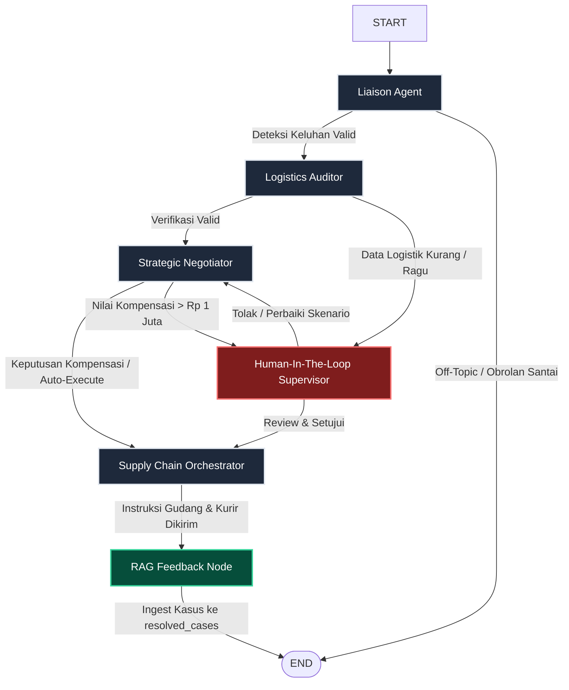

Sistem **OmniResolve-AI** menggunakan paradigma **Multi-Agent Orchestration** yang ditenagai oleh **LangGraph** dan **PgVector (PostgreSQL)**. Alih-alih berupa alur linier satu arah, agen-agen di dalam OmniResolve-AI berkomunikasi secara asinkron melalui sebuah *State* bersama untuk memverifikasi logistik, melakukan audit klaim, merundingkan keputusan bisnis, dan menyusun pesan balasan secara empati.

---

## 1. Topologi Orkestrasi LangGraph

Di bawah ini adalah representasi visual dari bagaimana LangGraph mengatur jalannya aliran data (*GraphState*) di antara sub-agen hingga kompensasi berhasil diproses dan disimpan sebagai pembelajaran di PgVector:

---

## 2. Mengenal 4 Agen Utama

### 1. Liaison Agent 🗣️
*   **Peran:** Menjadi garda depan yang berinteraksi langsung dengan pelanggan (Telegram Bot).
*   **Fungsi Utama:** Menerima pesan keluhan, mem-parsing informasi penting (Order ID, Tipe Keluhan, Foto Bukti), menyaring pesan di luar topik Qhomemart (*domain guardrails*), serta mengklasifikasikan tipe insiden.
*   **RAG Context:** Mengambil pola FAQ dari koleksi `faq_patterns` untuk menyusun klasifikasi insiden awal.

### 2. Logistics Auditor 🔍
*   **Peran:** Detektif logistik sistem.
*   **Fungsi Utama:** Melakukan kueri ke ERP (tabel pesanan, tabel pengiriman) untuk mencocokkan klaim pelanggan dengan fakta lapangan (misalnya: memverifikasi berat kiriman, log perjalanan kurir, atau rekaman CCTV bongkar muat).
*   **RAG Context:** Menelusuri sejarah kasus serupa dari `resolved_cases` untuk mempercepat pemahaman anomali audit.

### 3. Strategic Negotiator ⚖️
*   **Peran:** Pengambil keputusan keuangan dan bisnis.
*   **Fungsi Utama:** Merujuk kebijakan perusahaan (SOP) untuk memutuskan solusi terbaik (Refund, Replacement, Voucher, atau Reject) secara aman dan mencegah kerugian finansial berlebih.
*   **RAG Context:** Membaca dokumen kebijakan terbaru dari `sop_policies` dan mencocokkan taksiran kompensasi berdasarkan nilai CLV pelanggan.

### 4. Supply Chain Orchestrator 🚚
*   **Peran:** Eksekutor tindakan taktis.
*   **Fungsi Utama:** Memicu aksi operasional nyata di database ERP (seperti memproses refund, memperbarui stok barang, atau menjadwalkan ulang kurir), mengirimkan perintah kerja otomatis ke grup Telegram Gudang dan Kurir, serta menyusun pesan balasan empati kepada pelanggan.
*   **RAG Context:** Menyelaraskan intonasi kalimat balasan yang terbukti efektif dari preseden kasus sebelumnya.

---

## 3. RAG Feedback Loop (Continual Learning)

Keunggulan utama OmniResolve-AI adalah ia menjadi **semakin cerdas seiring bertambahnya kasus yang diselesaikan**. 

Setelah simpul `Supply Chain Orchestrator` sukses mengirimkan solusi akhir:
1. Alur akan diarahkan ke **`rag_feedback_node`**.
2. Node ini memproses seluruh *State* kasus yang baru selesai (Deskripsi keluhan, hasil keputusan audit, tindakan kompensasi, dan alasan negosiasi).
3. Seluruh data tersebut dienkapsulasi menjadi sebuah dokumen pengetahuan terstruktur, lalu di-ingest menggunakan LangChain Embedding ke koleksi **`resolved_cases`** di database vektor PgVector.
4. Ketika kasus baru masuk di masa mendatang, sub-agen akan secara otomatis memanggil kasus tersebut sebagai preseden pembanding sehingga tingkat akurasi verifikasi meningkat pesat.
